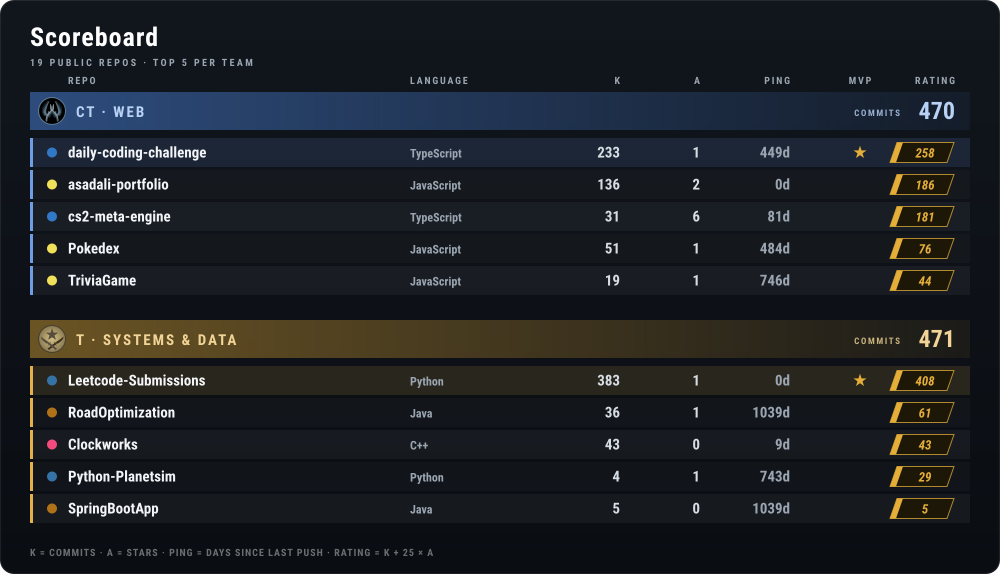
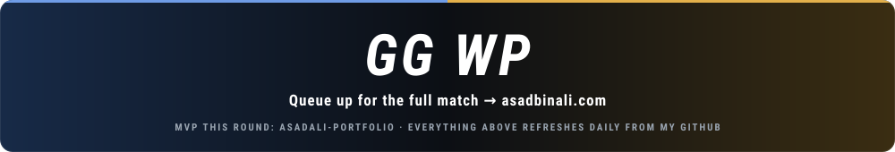

  
  
  

### 🎯 Player profile

- 🎓 Final-year Software Engineering (CO-OP) @ **University of Ottawa** · graduating Dec 2026
- 💼 Cloud Infrastructure Analyst Intern @ **Sun Life** · Fall 2026
- 🧭 Advisor (ex-Co-Director & Dev Lead) for the **uOttawa Software Engineering Students' Association (SESA)**
- 🔧 Currently building [**cs2-meta-engine**](https://github.com/Twoos123/cs2-meta-engine), a pro-level CS2 demo analysis platform
- 📬 Always up for a chat: `masadbali190@gmail.com`

Redrawn every day from my GitHub activity by <a href="scripts/generate.mjs">scripts/generate.mjs</a>. CS2 icons © Valve Corporation, extracted from the game files by <a href="https://github.com/Juknum/counter-strike-icons">Juknum/counter-strike-icons</a>; this profile isn't affiliated with Valve.

