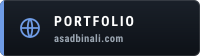
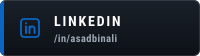
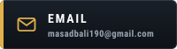

<!-- Generated from README.template.md by scripts/generate.mjs: edit the template, not README.md. -->

  
  
  
  

Redrawn every day from my GitHub activity and my portfolio's content by <a href="scripts/generate.mjs">scripts/generate.mjs</a>. CS2 icons © Valve Corporation, extracted from the game files by <a href="https://github.com/Juknum/counter-strike-icons">Juknum/counter-strike-icons</a>; the Mirage screenshot and radar are Valve's too (<a href="images/SOURCE.md">sources</a>). This profile isn't affiliated with Valve.

